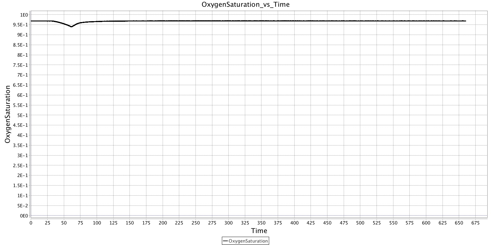
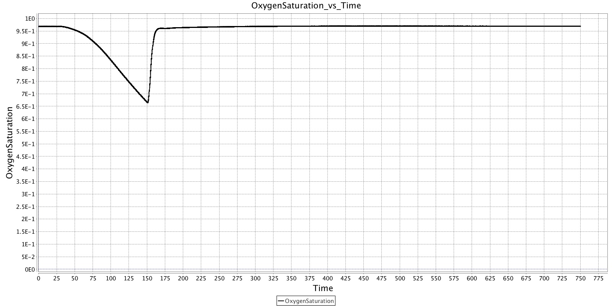
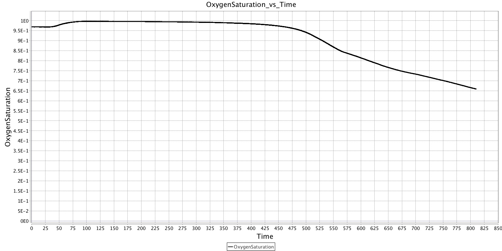
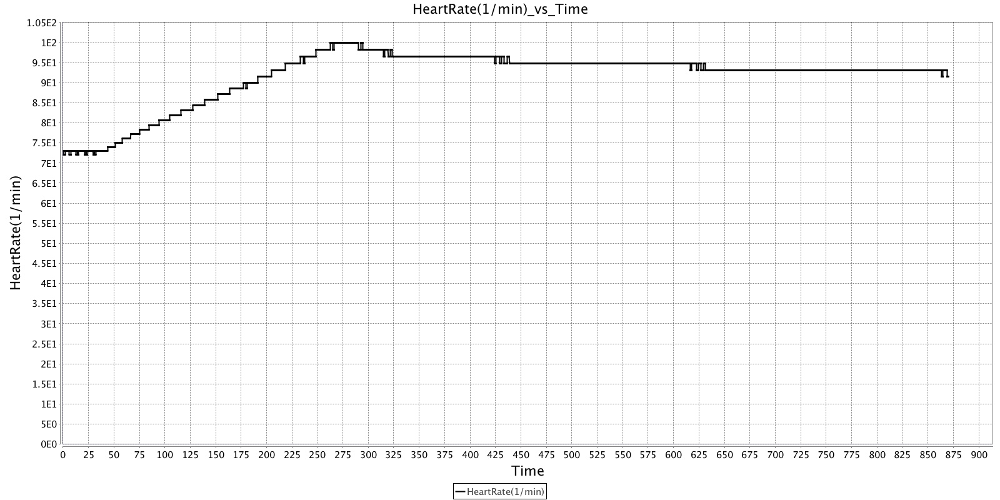
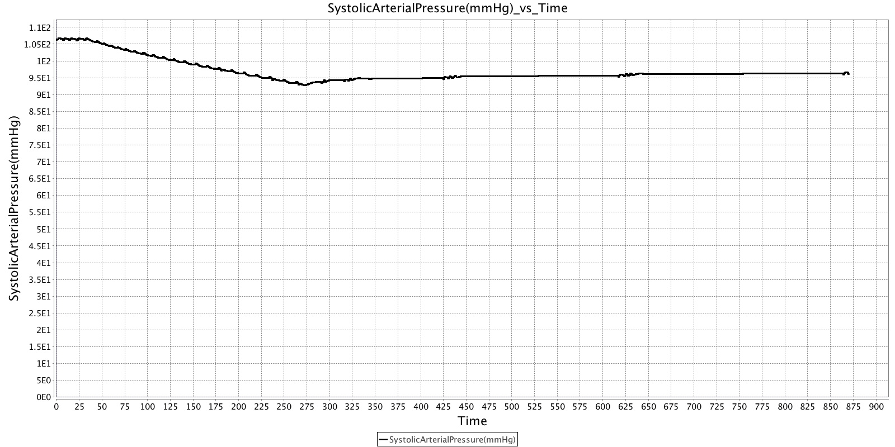

# BioGears-Paper
It's a place to store papers and materials about the paper for biogears

# Papers Collected (Alphabetic Order)
- Analysis of the Total Surgical Cardiac Denervation by Computer Simulation
  - Link: [papers/analysis-of-the-total-surgical-cardiac-denervation-by-computer-simulation.pdf](papers/analysis-of-the-total-surgical-cardiac-denervation-by-computer-simulation.pdf)
  - Comment:
    - Xiao Han: It is a paper about simulating urinary system, we don't know how to simulate renal nerve sympathetic activity, like which drug triggers that activity.
- Circulation: Overall Regulation
  - Link: [papers/circulation-overall-regulation.pdf](papers/circulation-overall-regulation.pdf)
  - Comment:
    - Guan Wang: This paper is about simulation of changes in circulatory function at the onset of hypertension caused by reduction of renal mass to normal and simultaneous increase in salt intake. Biogears do provide ability to simulate similar scenarios so we will try to simulate it in the future.
- Coherence of Cardiac Output with Rate Changes
  - Link: [papers/coherence-of-cardiac-output-with-rate-changes.pdf](papers/coherence-of-cardiac-output-with-rate-changes.pdf)
  - Comment:
- Hypertension Caused by Salt Loading in the Dog
  - Link: [papers/hypertension-caused-by-salt-loading-in-the-dog.pdf](papers/hypertension-caused-by-salt-loading-in-the-dog.pdf)
  - Comment:
    - Guan Wang: Since salt loading scenario could be simulated in dog, we were thinking about simulating similar scenario in human using both cae software and biogears and compute their difference.
- Hypertension Caused by Salt Loading II Fluid Volume and Tissue Pressure Changes.
  - Link: [papers/hypertension-caused-by-salt-loading.pdf](papers/hypertension-caused-by-salt-loading.pdf)
  - Comment:
- Implementation of a Model of Bodily Fluids Regulation
  - Link: [papers/implementing-of-a-model-of-bodily-fluids-regulation.pdf](papers/implementing-of-a-model-of-bodily-fluids-regulation.pdf)
  - Comment:
- Measuring the Repeatability of Simulated Physiology in Simulators
  - Link:[papers/measuring-the-repeatability-of-simulated-physiology-in-simulators](papers/measuring-the-repeatability-of-simulated-physiology-in-simulators.pdf)
  - Comment:
    - Guan Wang: We will be building our paper framework based on this paper cause this is a good example showing how experiments' done and recorded.
- Numerical Simulation of the Hemodynamic Response to Hemodialysis-Induced Hypovolemia
  - Link:[papers/numerial-simulation-of-the-hemodynamic-response-to-hemodialysis-induced-hypovolemia.pdf](papers/numerial-simulation-of-the-hemodynamic-response-to-hemodialysis-induced-hypovolemia.pdf)
  - Comment:
- Physiologic Control of Arterial Pressure
  - Link:[papers/physiologic-control-of-arterial-pressure.pdf](papers/physiologic-control-of-arterial-pressure.pdf)
  - Comment:
- Simulation and Prediction of Cardiotherapeutical Phenomena From a Pulsatile Model Coupled to the Guyton Circulatiory Model.
  - Link:[papers/simulation-and-prediction-of-cardiotherapeutical-phenomena-from-a-pulsatile-model-coupled-to-the-guyton-circulatiory-model.pdf](papers/simulation-and-prediction-of-cardiotherapeutical-phenomena-from-a-pulsatile-model-coupled-to-the-guyton-circulatiory-model.pdf)
  - Comment:
    - Xiao Han: It's a paper simulating blood pressure in the hearts using Guyton Model, but most charts in the paper use the time unit of ms, which is beyond the precision of BioGears (I think).
- Simulators for use in Anaesthesia
  - Link:[papers/simulators-for-use-in-anaesthesia.pdf](papers/simulators-for-use-in-anaesthesia.pdf)
  - Comment:
- Two open access, high-quality datasets from anesthetic records
  - Link:[papers/two-open-access-high-quality-database-from-anesthetic-records.pdf](papers/two-open-access-high-quality-database-from-anesthetic-records.pdf)
  - Comment:
    - Guan Wang: I have inspected the database and two datasets are about the data where patients all have shoulder Arthroscopy. The data format is in xml and easy to process in comparison with biogears, but we will have to discuss it with Doctor Mclvor.

## Papers with no access

    (Found)Cumin, David, Charlotte Chen, and Alan F. Merry. "Measuring the repeatability of simulated physiology in simulators." Simulation in Healthcare 10.6 (2015): 336-344.

# BioGears Simulation
## Bradypnea Simulation (Stops Breathing)
### Scenario 1
Standard Patient stops breathing for 30s and recover.

### Scenario 2
Standard Patient stops breathing for 120s and recover.

### Scenario 3
Obesity Patient given 1 min of pure oxygen and then stops breathing

## Hemorrhage (Bleeding)
### Scenario 1
Standard Patient bleed for 250ml/min for 4 mins then stops bleeding.

